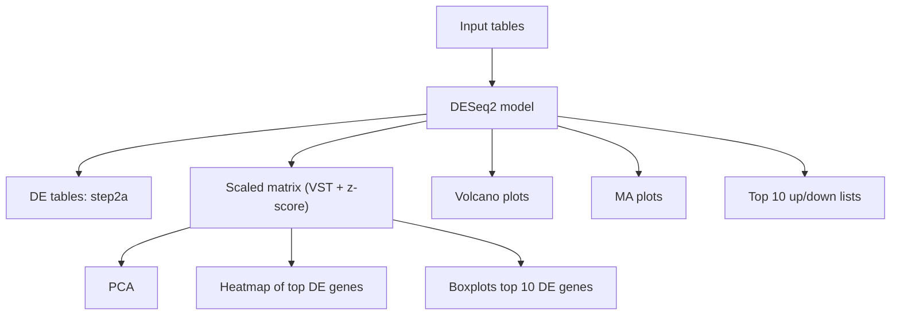

# Rexploration Omega (demo features)

## Workflow


## TL;DR
- Run with p-values:
  - `nextflow run main.nf --pcol pvalue --pthresh 0.01 --lfc 1`
- Run with adjusted p-values:
  - `nextflow run main.nf --pcol padj --pthresh 0.05 --lfc 1`
- Run using existing DE tables:
  - `nextflow run main.nf --input_type de_tables --de_tables "sample_input/de_duct_vs_gut.csv,sample_input/de_node_vs_duct.csv" --input_dir sample_input`

Outputs are written to `output_step2a` and either `output_step2b` (pvalue) or `output_step2c` (padj).
When `--input_type de_tables` and expression inputs are also present, plots go to `output_step2c` (pvalue) or `output_step2d` (padj).

## Overview
This pipeline runs DESeq2 on the provided experiment inputs, filters non-finite values, produces DE tables, PCA, heatmap, volcano/MA plots, boxplots, and top-10 up/down tables. It enforces the sample group order `gut -> duct -> node`.

### Inputs
Set `--input_type em` (default) and provide under `input/`:
- `em.csv` (tab-delimited expression matrix, first column `ID`)
- `sample_sheet.csv` (tab-delimited: `SAMPLE`, `SAMPLE_GROUP`)
- `annotations.csv` (tab-delimited: `Gene ID`, `Associated Gene Name`)

Alternatively set `--input_type de_tables` and provide one or more DE tables via `--de_tables`:
- `--de_tables` accepts a comma-separated list of file paths.
- Required columns per DE table: gene id, log2 fold change, p-value, adjusted p-value.
- Optional: `baseMean` (enables MA plots).
- If a gene symbol column is present, it is used; otherwise `annotations.csv` is used when available.
- If `em.csv` + `sample_sheet.csv` are also present, PCA/heatmap/boxplots are generated from the expression matrix.

### Outputs
Always:
- `output_step2a/*.tsv` for each DE table input or computed contrast

When `--pcol pvalue`:
- `output_step2b/` with volcano, MA (if baseMean exists), and top-10 tables
- PCA, heatmap, and boxplots are generated when expression matrix inputs are available (`em.csv` + `sample_sheet.csv`), even if `--input_type de_tables`

When `--pcol padj`:
- `output_step2c/` with the same plots/tables based on adjusted p-values

When `--input_type de_tables` and expression inputs are available:
- `output_step2c/` (pvalue) or `output_step2d/` (padj) are used for plots/tables

### Parameters
- `--pcol` : `pvalue` or `padj`
- `--pthresh` : significance threshold (default `0.01`)
- `--lfc` : absolute log2 fold-change threshold (default `1`)
- `--input_dir` : input directory (default `input`)
- `--outdir` : output directory (default `.`)
- `--input_type` : `em` or `de_tables` (default `em`)
- `--de_tables` : comma-separated list of DE table paths (required for `de_tables`)


## Run locally
```bash
nextflow run main.nf --pcol pvalue --pthresh 0.01 --lfc 1
```

Using precomputed DE tables:
```bash
nextflow run main.nf --input_type de_tables --de_tables "sample_input/de_duct_vs_gut.csv,sample_input/de_node_vs_duct.csv" --input_dir sample_input
```

## Docker
If you prefer Docker, create a minimal container with R and required packages. Then run:
```bash
nextflow run main.nf -profile docker --pcol pvalue --pthresh 0.01 --lfc 1
```

You will need a Docker-enabled `nextflow.config` profile that sets `process.container` to an image containing:
- R (>= 4.2 recommended)
- Bioconductor `DESeq2`
- CRAN: `ggplot2`, `ggrepel`, `pheatmap`

## Conda
Create a conda env with R + packages and use Nextflow's conda profile:
```bash
nextflow run main.nf -profile conda --pcol pvalue --pthresh 0.01 --lfc 1
```

Example `nextflow.config` snippet for conda:
```
profiles {
  conda {
    process.conda = 'conda/renv.yml'
  }
  docker {
    process.container = 'your-docker-image:tag'
  }
}
```

## Notes
- The pipeline filters out NaN/Inf values before writing outputs.
- Sample group order is enforced as `gut`, `duct`, `node`.
- Labels on volcano/MA plots use `geom_label_repel`.
